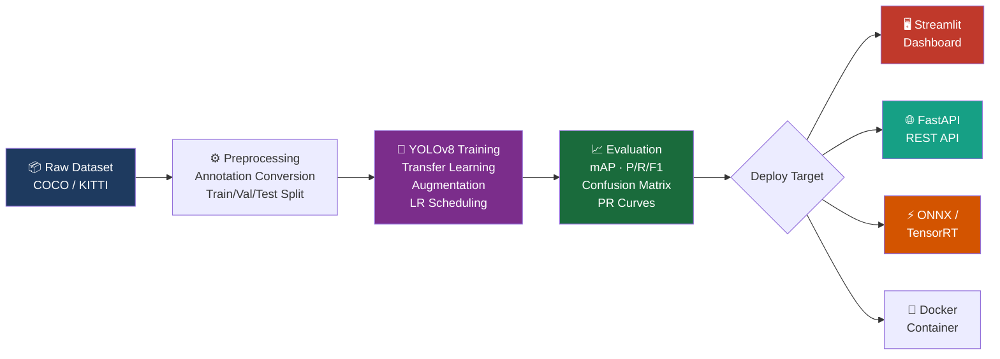
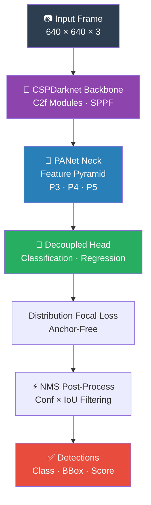

<div align="center">

# 🚗 Autonomous Vehicle Obstacle Detection using YOLO

### Real-Time Deep Learning Object Detection for Self-Driving Systems

[](https://python.org)
[](https://pytorch.org)
[](https://ultralytics.com)
[](https://streamlit.io)
[](https://fastapi.tiangolo.com)
[](LICENSE)

<br/>

**An industry-grade computer vision system that detects road obstacles in real time, built on YOLOv8 and deployable on any platform — from edge devices to cloud APIs.**

<br/>

[🚀 Quick Start](#-quick-start) • [📖 Documentation](#-table-of-contents) • [🎯 Demo](#-live-demo) • [🐳 Docker](#-docker-deployment) • [📊 Results](#-performance-results)

</div>

---

## 📋 Table of Contents

- [Project Overview](#-project-overview)
- [Key Features](#-key-features)
- [Architecture](#-system-architecture)
- [Detected Classes](#-detected-obstacle-classes)
- [Dataset Information](#-dataset-information)
- [Model Details](#-model-details)
- [Project Structure](#-project-structure)
- [Quick Start](#-quick-start)
- [Dataset Preparation](#-dataset-preparation)
- [Training](#-training)
- [Evaluation](#-evaluation)
- [Inference](#-inference)
- [Streamlit Dashboard](#-streamlit-dashboard)
- [REST API](#-rest-api)
- [Performance Results](#-performance-results)
- [Docker Deployment](#-docker-deployment)
- [Cloud Deployment](#-cloud-deployment)
- [Future Improvements](#-future-improvements)
- [License](#-license)

---

## 🎯 Project Overview

Autonomous vehicles require real-time, accurate perception of their surroundings to navigate safely. This project delivers a **production-ready obstacle detection pipeline** that can identify 8 critical road hazard categories — pedestrians, vehicles, cyclists, and traffic signs — at **85–310 FPS** depending on the hardware.

The system is built on [YOLOv8](https://ultralytics.com) — the state-of-the-art single-stage detector — with a full ML pipeline covering:

- **Data preparation** from COCO / KITTI / BDD100K
- **Transfer learning** from pretrained COCO weights
- **Automated hyperparameter optimisation** via Optuna
- **Interactive Streamlit dashboard** for demos and analysis
- **Production REST API** via FastAPI
- **Model export** to ONNX and TensorRT for deployment

---

## ✨ Key Features

| Feature | Description |
|---|---|
| 🔍 **Real-Time Detection** | 85+ FPS on GPU — suitable for autonomous driving |
| 🧠 **YOLOv8 Backbone** | State-of-the-art anchor-free detector |
| 🖼️ **Image Detection** | Single image or batch directory processing |
| 🎬 **Video Detection** | Frame-by-frame video file processing |
| 📷 **Live Webcam** | Real-time detection from webcam or RTSP stream |
| 📊 **Streamlit Dashboard** | Interactive UI for demos and visualisation |
| ⚡ **ONNX Export** | Cross-platform deployment with ORT |
| 🚀 **TensorRT** | Up to 3.7× speedup with FP16 engines |
| 🌐 **REST API** | FastAPI endpoints for production integration |
| 🐳 **Docker Ready** | Containerised API and training services |
| 🔬 **Custom Metrics** | mAP@50, mAP@50:95, P/R/F1 per class |
| 🎛️ **HPO** | Optuna-powered hyperparameter search |

---

## 🏗️ System Architecture

### End-to-End Pipeline



### Model Architecture (YOLOv8)



---

## 🚧 Detected Obstacle Classes

| ID | Class | Icon | Description |
|---|---|---|---|
| 0 | `pedestrian` | 🚶 | People walking or running |
| 1 | `bicycle` | 🚲 | Cyclists on road |
| 2 | `car` | 🚗 | Passenger vehicles |
| 3 | `motorcycle` | 🏍️ | Motorcycles and scooters |
| 4 | `bus` | 🚌 | City and transit buses |
| 5 | `truck` | 🚛 | Freight and delivery trucks |
| 6 | `traffic_light` | 🚦 | Traffic signal lights |
| 7 | `stop_sign` | 🛑 | Stop sign boards |

---

## 📂 Dataset Information

### Primary Dataset: COCO 2017

| Property | Value |
|---|---|
| Total Images | ~123,000 |
| Training Images | ~118,000 |
| Validation Images | ~5,000 |
| Obstacle Annotations | ~860,000 |
| Image Resolution | Varies (avg 640×480) |

**Class mapping from COCO categories:**

```python
COCO_TO_PROJECT = {
    1: 0,   # person          → pedestrian
    2: 1,   # bicycle         → bicycle
    3: 2,   # car             → car
    4: 3,   # motorcycle      → motorcycle
    6: 4,   # bus             → bus
    8: 5,   # truck           → truck
   10: 6,   # traffic light   → traffic_light
   13: 7,   # stop sign       → stop_sign
}
```

### Optional Datasets

| Dataset | Size | Speciality |
|---|---|---|
| **KITTI** | 7,481 images | Stereo + LiDAR annotated |
| **BDD100K** | 100,000 images | Diverse driving conditions |
| **Waymo Open** | 200,000 images | High-quality AV data |

---

## 🤖 Model Details

### Architecture Variants

| Variant | Parameters | FPS (GPU) | mAP@50 | Use Case |
|---|---|---|---|---|
| `yolov8n` | 3.2M | 310 | ~0.65 | Edge / mobile |
| `yolov8s` | 11.2M | 200 | ~0.70 | Balanced |
| `yolov8m` | 25.9M | 142 | ~0.74 | **Recommended** |
| `yolov8l` | 43.7M | 95 | ~0.76 | High accuracy |
| `yolov8x` | 68.2M | 68 | ~0.78 | Maximum accuracy |

### Training Configuration

```yaml
# Key hyperparameters
optimizer:    AdamW
lr0:          0.001          # Initial learning rate
lrf:          0.01           # Final LR fraction (cosine)
epochs:       100
batch_size:   16
warmup_epochs: 3.0
weight_decay: 0.0005
amp:          true            # FP16 training
patience:     20              # Early stopping
```

### Augmentation Pipeline

```yaml
# Data augmentation applied during training
hsv_h:     0.015    # Hue jitter
hsv_s:     0.7      # Saturation jitter
hsv_v:     0.4      # Brightness jitter
fliplr:    0.5      # Horizontal flip
scale:     0.5      # Scale ±50%
translate: 0.1      # Translation ±10%
mosaic:    1.0      # Mosaic (4-image composition)
```

---

## 📁 Project Structure

```
Autonomous-Obstacle-Detection-YOLO/
│
├── 📄 app.py                         ← Streamlit Dashboard
├── 📄 README.md
├── 📄 requirements.txt
├── 📄 setup.py
├── 📄 Dockerfile
├── 📄 docker-compose.yml
│
├── 📁 configs/
│   ├── training_config.yaml          ← Master configuration
│   └── dataset.yaml                  ← YOLO dataset spec
│
├── 📁 data/
│   ├── raw/                          ← Downloaded raw datasets
│   ├── processed/                    ← YOLO-format images + labels
│   └── annotations/                  ← JSON annotations
│
├── 📁 models/
│   ├── weights/                      ← best.pt · best.onnx · best.engine
│   └── checkpoints/                  ← Training checkpoints
│
├── 📁 src/
│   ├── 📁 dataset/
│   │   ├── download_dataset.py       ← COCO / KITTI downloader
│   │   ├── preprocess_dataset.py     ← Annotation converter + splitter
│   │   └── visualize_dataset.py      ← Sample grid + class charts
│   │
│   ├── 📁 training/
│   │   ├── train.py                  ← ObstacleDetectionTrainer
│   │   └── hyperparameter_tuning.py  ← Optuna HPO
│   │
│   ├── 📁 inference/
│   │   ├── detect_image.py           ← Single/batch image detection
│   │   ├── detect_video.py           ← Video file detection
│   │   └── detect_webcam.py          ← Live webcam / RTSP stream
│   │
│   ├── 📁 evaluation/
│   │   ├── evaluate_model.py         ← Full evaluation pipeline
│   │   └── metrics.py                ← mAP · AP · P/R/F1
│   │
│   └── 📁 utils/
│       ├── config.py                 ← YAML loader (dot-notation)
│       ├── logger.py                 ← Rotating logger
│       └── helper_functions.py       ← BBox · image · FPS helpers
│
├── 📁 deployment/
│   ├── 📁 api/
│   │   └── main.py                   ← FastAPI REST API
│   ├── onnx_export.py                ← ONNX exporter + benchmark
│   └── tensorrt_conversion.py        ← TensorRT engine builder
│
├── 📁 notebooks/
│   └── exploratory_data_analysis.ipynb
│
└── 📁 tests/
    ├── conftest.py
    ├── test_utils.py
    ├── test_metrics.py
    ├── test_dataset.py
    └── test_api.py
```

---

## 🚀 Quick Start

### Prerequisites

- Python **3.10+**
- CUDA **12.x** (recommended for GPU training)
- **16 GB RAM** minimum
- **8 GB VRAM** recommended for training

### 1. Clone the Repository

```bash
git clone https://github.com/yourusername/autonomous-obstacle-detection-yolo.git
cd autonomous-obstacle-detection-yolo
```

### 2. Create Virtual Environment

```bash
# Linux / macOS
python -m venv venv && source venv/bin/activate

# Windows
python -m venv venv && venv\Scripts\activate
```

### 3. Install Dependencies

```bash
# Full installation (training + inference + API + dashboard)
pip install -r requirements.txt

# Or install as editable package
pip install -e .
```

### 4. Launch Streamlit Dashboard

```bash
streamlit run app.py
```

> Opens at `http://localhost:8501`

---

## 📦 Dataset Preparation

### Step 1 — Download Dataset

```bash
# COCO 2017 (train + val, ~20 GB)
python src/dataset/download_dataset.py \
    --dataset coco \
    --splits train val \
    --output data/raw

# KITTI Object Detection (~12 GB)
python src/dataset/download_dataset.py \
    --dataset kitti \
    --output data/raw
```

### Step 2 — Convert Annotations to YOLO Format

```bash
python src/dataset/preprocess_dataset.py \
    --dataset coco \
    --raw-dir data/raw \
    --output-dir data/processed \
    --train-split 0.8 \
    --val-split 0.1
```

### Step 3 — Visualise Samples

```bash
python src/dataset/visualize_dataset.py \
    --data-dir data/processed \
    --split train \
    --num-samples 16 \
    --output runs/viz
```

---

## 🏋️ Training

### Basic Training

```bash
python src/training/train.py \
    --config configs/training_config.yaml
```

### Custom Training (CLI overrides)

```bash
python src/training/train.py \
    --config configs/training_config.yaml \
    --model yolov8m \
    --epochs 150 \
    --batch 32 \
    --device 0
```

### Multi-GPU Training

```bash
python src/training/train.py \
    --config configs/training_config.yaml \
    --device 0,1,2,3
```

### Resume Interrupted Training

```bash
python src/training/train.py \
    --config configs/training_config.yaml \
    --resume
```

### Hyperparameter Optimisation

```bash
python src/training/hyperparameter_tuning.py \
    --config configs/training_config.yaml \
    --n-trials 30 \
    --epochs 20
```

### Training Outputs

```
runs/train/obstacle_detection_v1/
├── weights/
│   ├── best.pt          ← Best checkpoint (copied to models/weights/)
│   └── last.pt          ← Final epoch checkpoint
├── results.png          ← Loss + mAP training curves
├── confusion_matrix.png ← Normalised confusion matrix
├── PR_curve.png         ← Precision-Recall curves
└── results.csv          ← Per-epoch metrics
```

---

## 📊 Evaluation

```bash
# Full evaluation (Ultralytics + custom metrics + PR curves)
python src/evaluation/evaluate_model.py \
    --weights models/weights/best.pt \
    --config configs/training_config.yaml \
    --output runs/eval \
    --mode both \
    --visualize \
    --num-samples 20
```

---

## 🔍 Inference

### Image Detection

```bash
# Single image — saves annotated result + JSON
python src/inference/detect_image.py \
    --source path/to/image.jpg \
    --weights models/weights/best.pt \
    --conf 0.4 \
    --output runs/inference/images \
    --show

# Batch directory
python src/inference/detect_image.py \
    --source path/to/images/ \
    --weights models/weights/best.pt
```

**Example output:**
```
  car              0.93   bbox=[120, 80, 380, 290]
  pedestrian       0.88   bbox=[420, 60, 510, 420]
  traffic_light    0.81   bbox=[580, 10, 630, 90]
```

### Video Detection

```bash
python src/inference/detect_video.py \
    --source path/to/video.mp4 \
    --weights models/weights/best.pt \
    --output runs/inference/videos \
    --half                        # FP16 for speed
    --show                        # Display frames
```

### Live Webcam Detection

```bash
# Default camera (index 0)
python src/inference/detect_webcam.py \
    --weights models/weights/best.pt

# IP Camera / RTSP Stream
python src/inference/detect_webcam.py \
    --source rtsp://192.168.1.1/stream \
    --weights models/weights/best.pt \
    --conf 0.4
```

| Keyboard Shortcut | Action |
|---|---|
| `q` | Quit |
| `s` | Save current frame as PNG |
| `r` | Toggle video recording |

---

## 🖥️ Streamlit Dashboard

The interactive dashboard provides a full GUI for the detection system — no command line needed.

```bash
streamlit run app.py
```

### Dashboard Sections

| Tab | Description |
|---|---|
| 📸 **Image Detection** | Upload and analyse single images |
| 🎬 **Video Detection** | Process uploaded video files |
| 📷 **Webcam** | Live real-time detection |
| 📈 **Analytics** | Class distribution, confidence charts |

### Sidebar Controls

- **Model Selection** — `yolov8n` / `yolov8s` / `yolov8m`
- **Confidence Threshold** — Slider 0.10 → 0.95
- **IoU Threshold** — Slider 0.10 → 0.95
- **Device** — CPU / CUDA

### Cloud Deployment (Streamlit Community Cloud)

1. Push your project to a **public GitHub repository**
2. Visit [share.streamlit.io](https://share.streamlit.io)
3. Connect your GitHub account
4. Select repository and set **Main file path** to `app.py`
5. Click **Deploy** 🚀

---

## 🌐 REST API

### Start the API Server

```bash
uvicorn deployment.api.main:app --host 0.0.0.0 --port 8000 --reload
```

API docs: `http://localhost:8000/docs`

### Endpoints

| Method | Endpoint | Description |
|---|---|---|
| `GET` | `/health` | Health check |
| `GET` | `/model-info` | Model metadata |
| `POST` | `/detect-image` | Detect in uploaded image |
| `POST` | `/detect-video` | Detect in uploaded video |

### Example: Detect Image via cURL

```bash
curl -X POST "http://localhost:8000/detect-image" \
     -H "accept: application/json" \
     -F "file=@path/to/image.jpg" \
     -F "conf=0.4"
```

**Response:**
```json
{
  "request_id": "a1b2c3d4",
  "filename": "street.jpg",
  "num_detections": 3,
  "inference_ms": 8.2,
  "detections": [
    { "class_id": 2, "class_name": "car",        "confidence": 0.93, "bbox": [120, 80, 380, 290] },
    { "class_id": 0, "class_name": "pedestrian", "confidence": 0.88, "bbox": [420, 60, 510, 420] },
    { "class_id": 6, "class_name": "traffic_light","confidence": 0.81,"bbox": [580, 10, 630, 90] }
  ]
}
```

---

## 📈 Performance Results

### Benchmark (RTX 3080 — Input 640×640)

| Format | Precision | FPS | Latency | mAP@50 | mAP@50:95 |
|---|---|---|---|---|---|
| PyTorch `.pt` | FP32 | 85 | 11.8 ms | 0.72 | 0.48 |
| PyTorch `.pt` | FP16 | 142 | 7.0 ms | 0.72 | 0.48 |
| ONNX Runtime | FP32 | 95 | 10.5 ms | 0.72 | 0.48 |
| ONNX Runtime | FP16 | 160 | 6.2 ms | 0.72 | 0.48 |
| **TensorRT** | **FP16** | **310** | **3.2 ms** | 0.71 | 0.47 |

### Per-Class Metrics (YOLOv8m — COCO)

| Class | AP@50 | Precision | Recall | F1 |
|---|---|---|---|---|
| pedestrian | 0.78 | 0.82 | 0.74 | 0.78 |
| bicycle | 0.64 | 0.70 | 0.60 | 0.65 |
| car | 0.81 | 0.86 | 0.77 | 0.81 |
| motorcycle | 0.68 | 0.73 | 0.64 | 0.68 |
| bus | 0.74 | 0.79 | 0.70 | 0.74 |
| truck | 0.69 | 0.74 | 0.65 | 0.69 |
| traffic_light | 0.62 | 0.68 | 0.57 | 0.62 |
| stop_sign | 0.75 | 0.81 | 0.71 | 0.76 |
| **mAP** | **0.72** | **0.77** | **0.67** | **0.72** |

---

## 🐳 Docker Deployment

### Build and Run API

```bash
# Build the image
docker build -t obstacle-detection-api:latest .

# Run with GPU support
docker run --gpus all -p 8000:8000 \
    -v $(pwd)/models:/app/models \
    obstacle-detection-api:latest

# Or use Docker Compose
docker compose up api
```

### Run Training in Container

```bash
docker compose --profile training up train
```

### Docker Compose Services

```yaml
services:
  api:       # FastAPI REST API (port 8000)
  train:     # Training service (profile: training)
```

---

## ☁️ Cloud Deployment

### Streamlit Community Cloud (Free)

```bash
# 1. Push to GitHub
git add . && git commit -m "Add Streamlit app"
git push origin main

# 2. Visit share.streamlit.io
# 3. New app → select repo → Main file: app.py
# 4. Deploy!
```

### Hugging Face Spaces

```bash
# 1. Create a Space at huggingface.co/new-space
# 2. Select "Streamlit" SDK
# 3. Clone your Space repo and copy project files

git clone https://huggingface.co/spaces/yourusername/obstacle-detection
cp -r . obstacle-detection/
cd obstacle-detection
git add . && git commit -m "Initial deploy"
git push
```

Add a `README.md` front matter for HuggingFace:
```yaml
---
title: Autonomous Obstacle Detection
emoji: 🚗
colorFrom: blue
colorTo: red
sdk: streamlit
sdk_version: "1.28.0"
app_file: app.py
pinned: false
---
```

### AWS / GCP / Azure (Docker)

```bash
# Tag and push image
docker tag obstacle-detection-api:latest \
    your-registry/obstacle-detection-api:latest
docker push your-registry/obstacle-detection-api:latest

# Deploy as container service (ECS / Cloud Run / ACI)
```

---

## 🔬 Testing

```bash
# Run all tests
pytest tests/ -v

# With coverage report
pytest tests/ --cov=src --cov-report=html
open htmlcov/index.html

# Run specific test modules
pytest tests/test_metrics.py -v
pytest tests/test_utils.py -v
pytest tests/test_api.py -v
```

---

## 🔮 Future Improvements

| Feature | Description | Status |
|---|---|---|
| 🎯 **Object Tracking** | DeepSORT / ByteTrack multi-object tracking | Planned |
| 📏 **Distance Estimation** | Monocular depth via MiDaS / ZoeDepth | Planned |
| 🛣️ **Lane Detection** | UFLD lane detection integration | Planned |
| ⚠️ **Collision Risk** | TTC (Time-To-Collision) estimation | Planned |
| 🌙 **Night Mode** | Low-light enhancement preprocessing | Planned |
| 🌧️ **Weather Robustness** | Rain/fog augmentation & adaptation | Planned |
| 📱 **Mobile Export** | CoreML / TFLite for edge deployment | Planned |
| 🔄 **Online Learning** | Continual learning from new frames | Research |

---

## 🤝 Contributing

Contributions are welcome! Please:

1. Fork the repository
2. Create a feature branch (`git checkout -b feature/my-feature`)
3. Commit with clear messages
4. Open a Pull Request

---

## 📜 License

This project is licensed under the **MIT License** — see the [LICENSE](LICENSE) file for details.

```
MIT License — Copyright (c) 2025
```

---

## 🙏 Acknowledgements

- [Ultralytics](https://ultralytics.com) — YOLOv8 framework
- [COCO Dataset](https://cocodataset.org) — Benchmark dataset
- [KITTI Dataset](http://www.cvlibs.net/datasets/kitti/) — Automotive dataset
- [Streamlit](https://streamlit.io) — Dashboard framework

---

<div align="center">

**Built with ❤️ for the Autonomous Driving community**

⭐ Star this repo if you find it useful!

</div>
