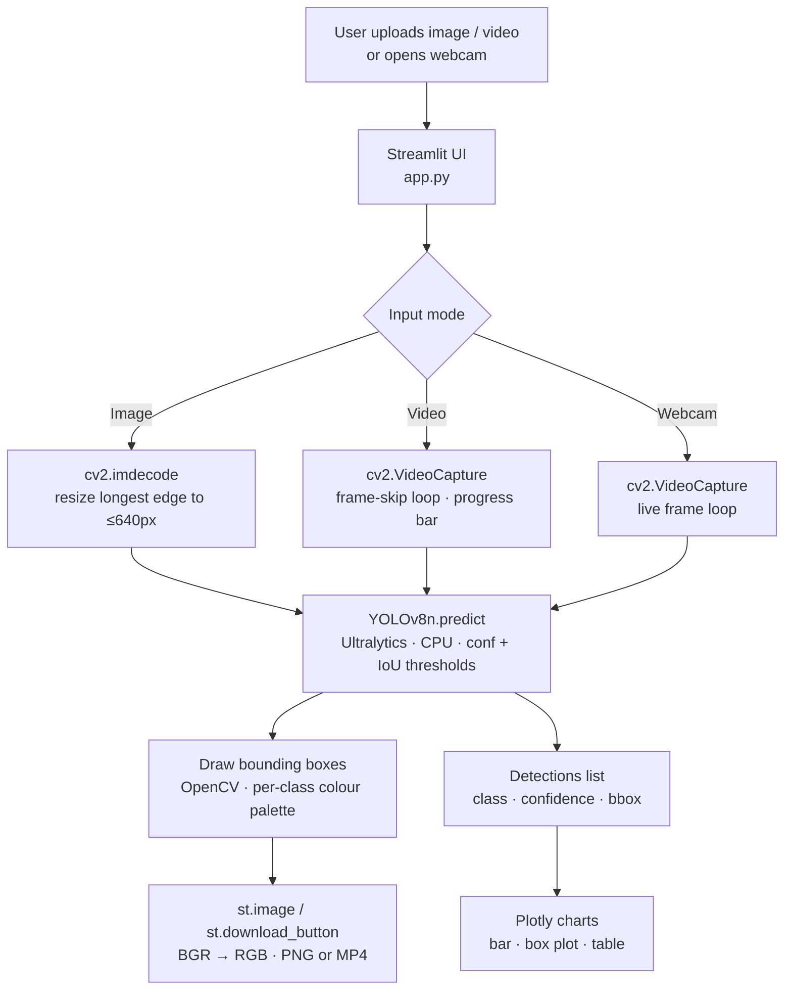

# Autonomous Vehicle Obstacle Detection — YOLOv8

> A four-tab Streamlit dashboard for real-time road obstacle detection using a pretrained YOLOv8n model.

[](https://python.org)
[](https://streamlit.io)
[](https://ultralytics.com)
[](https://huggingface.co/spaces)
[](LICENSE)

---

## What it does

- **Image detection** — Upload JPG / PNG / BMP / WEBP; the dashboard annotates bounding boxes and confidence scores and shows the original alongside the result. Download the annotated PNG in one click.
- **Video detection** — Process MP4 / AVI / MOV / MKV files frame-by-frame with a configurable frame-skip and frame cap to keep memory bounded. Download the fully annotated MP4 on completion.
- **Live webcam feed** — Capture frames from any connected camera or RTSP stream with a real-time FPS overlay. Works on localhost; cloud deployments should use Image or Video mode instead.
- **Detection analytics** — Interactive Plotly charts generated from the current session's inferences: detections-per-class bar chart, per-class confidence box plot, and a sortable detection table showing bounding-box dimensions.

Detects **8 classes** mapped from COCO:
`person · bicycle · car · motorcycle · bus · truck · traffic light · stop sign`

---

## Architecture


```mermaid
flowchart TD
    A[User uploads image / video\nor opens webcam] --> B[Streamlit UI\napp.py]
    B --> C{Input mode}
    C -->|Image| D[cv2.imdecode\nresize longest edge to ≤640px]
    C -->|Video| E[cv2.VideoCapture\nframe-skip loop · progress bar]
    C -->|Webcam| F[cv2.VideoCapture\nlive frame loop]
    D & E & F --> G[YOLOv8n.predict\nUltralytics · CPU · conf + IoU thresholds]
    G --> H[Draw bounding boxes\nOpenCV · per-class colour palette]
    H --> I[st.image / st.download_button\nBGR → RGB · PNG or MP4]
    G --> J[Detections list\nclass · confidence · bbox]
    J --> K[Plotly charts\nbar · box plot · table]
```

---

## Tech Stack

| Layer | Technology |
|---|---|
| Dashboard | Streamlit |
| Detection model | YOLOv8n (pretrained COCO weights, auto-downloaded via Ultralytics) |
| Computer vision | OpenCV (`opencv-python-headless`), NumPy |
| Charting | Plotly (no pandas dependency) |
| Image I/O | Pillow |
| Deployment | Hugging Face Spaces (Streamlit SDK) |

---

## Getting Started

### Prerequisites

- Python 3.10+

### Install

```bash
git clone https://github.com/pun33th45/autonomous-vehicle-obstacle-detection-yolo.git
cd autonomous-vehicle-obstacle-detection-yolo
pip install -r requirements.txt
```

### Run the dashboard

```bash
streamlit run app.py
```

Opens at [http://localhost:8501](http://localhost:8501).
The first launch downloads `yolov8n.pt` (~6 MB) automatically via Ultralytics.

---

## Project Structure

```
├── app.py                           # Streamlit dashboard — main entry point
├── requirements.txt                 # Runtime dependencies (6 packages)
├── configs/
│   ├── training_config.yaml         # YOLOv8 training hyperparameters
│   └── dataset.yaml                 # Dataset paths for custom fine-tuning
├── src/
│   ├── training/train.py            # Training pipeline (AdamW · cosine LR · mosaic aug)
│   ├── inference/
│   │   ├── detect_image.py          # CLI: single image or batch directory
│   │   ├── detect_video.py          # CLI: video file with FP16 option
│   │   └── detect_webcam.py         # CLI: live webcam / RTSP stream
│   ├── evaluation/evaluate_model.py # mAP · Precision · Recall · F1 evaluation
│   └── utils/                       # Config loader · rotating logger · bbox helpers
├── deployment/
│   ├── api/main.py                  # Optional FastAPI REST endpoint
│   ├── onnx_export.py               # Export to ONNX
│   └── tensorrt_conversion.py       # Export to TensorRT
└── docs/                            # Demo GIF placeholder
```

---

## Optional: Fine-tune on Custom Data

The repo ships with a full YOLOv8 training pipeline for adapting the model to your own dataset.

```bash
# 1. Prepare a YOLO-format dataset at data/processed/
# 2. Update configs/dataset.yaml with the correct paths
# 3. Run training (GPU strongly recommended)
python src/training/train.py --config configs/training_config.yaml
```

Default config: YOLOv8m backbone · 100 epochs · AdamW · cosine LR · mosaic augmentation · early stopping (patience 20).

---

## Roadmap

- [ ] **Multi-model toggle** — Switch between YOLOv8n / s / m in the sidebar without restarting the app
- [ ] **Monocular depth estimation** — Integrate MiDaS to approximate obstacle distance from single-camera input
- [ ] **Session export** — Bundle all frame annotations and analytics from a session into a downloadable ZIP report

---

## Author

**Puneeth Raj** — AI Engineer · Full-Stack Developer

[](https://puneeth-dev.vercel.app)
[](https://linkedin.com/in/puneeth-raj-774506211/)
[](https://github.com/pun33th45)
